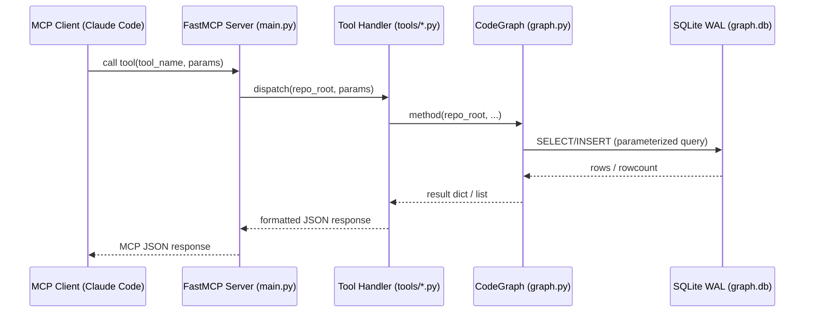
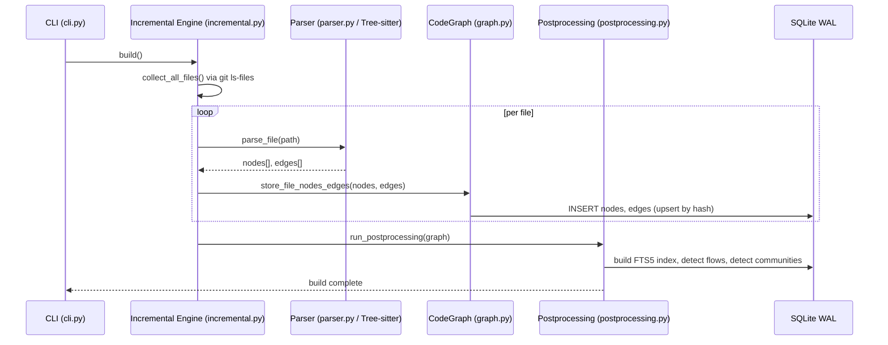
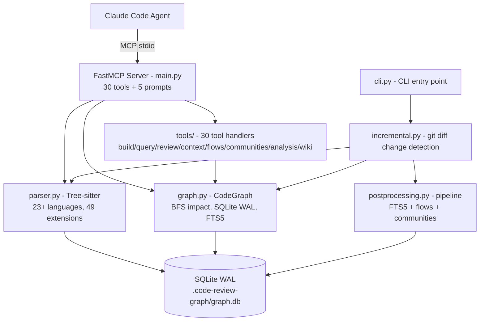

# Design Principles: code-review-graph

Báo cáo tổng hợp từ System Design Deep-Dive workflow (6 tasks: go4 → mw7 → 1fu+z6s → ek9 → 0ok).
Mọi code references đều clickable. Relative path từ file này: `../../code_review_graph/...`

---

## 1. Architecture Overview

> Nguồn: Task 1 (go4) — [`docs/architecture.md`](../../docs/architecture.md) + code scan

### Sequence Diagram — MCP Tool Call Flow (8 hops)



### Sequence Diagram — Full Build Flow



### Component Diagram



### Flows Table

| Flow | Actors | Trigger | Output |
|------|--------|---------|--------|
| Full Build | `cli.py → incremental.py → parser.py → graph.py → postprocessing.py` | `crg build` | graph.db populated, FTS5 + flows + communities |
| Incremental Update | `incremental.py → git diff → parser.py → graph.py` | `crg update` / PostToolUse hook | Changed nodes re-parsed, delta applied |
| MCP Tool Call | `Claude Code → FastMCP → tools/* → graph.py → SQLite` | LLM invokes tool | JSON response (impact, review context, query) |
| Review Context | `tools/review.py → graph.py BFS → source snippets` | `detect_changes + get_review_context` | Token-efficient context: blast radius, risk, test gaps |
| MCP Serve | `cli.py → main.py → FastMCP` | `crg serve` | stdio/HTTP server, 30 tools + 5 prompts |
| Wiki Generation | `cli.py → wiki.py → communities.py → graph.py` | `crg wiki` | Markdown wiki organized by community structure |

---

## 2. Core Components (Không thể thay thế)

> Nguồn: Task 2 (mw7)

### GraphStore — [`graph.py:142`](../../code_review_graph/graph.py#L142)

- **LOC:** 1358 (graph.py)
- **Dimension:** tight_coupling + critical_path
- **Tại sao không thể thay thế:** 12+ modules import trực tiếp. Single point of SQLite access — WAL mode, schema migrations, CRUD, BFS impact analysis, FTS5 search đều ở đây. Xóa → toàn bộ data layer sụp đổ.
- **Importers:** `postprocessing.py`, `tools/_common.py`, `tools/query.py`, `tools/review.py`, `tools/community_tools.py`, `search.py`, `flows.py`, `changes.py`, `exports.py`, `visualization.py`, `cli.py` (+2 nữa)

### CodeParser — [`parser.py:619`](../../code_review_graph/parser.py#L619)

- **LOC:** 4750 (parser.py — monolith, largest file)
- **Dimension:** critical_path
- **Tại sao không thể thay thế:** Không có parser → không có nodes → không có graph. [`EXTENSION_TO_LANGUAGE`](../../code_review_graph/parser.py#L74) dict (49 entries) defines toàn bộ language scope. Tree-sitter grammars tích hợp sâu.

### FastMCP Server — [`main.py:1`](../../code_review_graph/main.py#L1)

- **LOC:** 998 (main.py)
- **Dimension:** critical_path (MCP protocol boundary)
- **Tại sao không thể thay thế:** 30 tools + 5 prompts đăng ký tại đây qua `@mcp.tool()`. Xóa → toàn bộ MCP API surface biến mất. stdio/HTTP transport configuration ở đây.

---

## 3. Leverage Points (Điểm tựa)

> Nguồn: Task 2 (mw7) + Task 3 (1fu — exact lines + code snippets)

Leverage Point = điểm nhỏ nhưng chi phối nhiều behavior. "1 dòng thay đổi → X% behavior thay đổi."

---

### `_sanitize_name()` — Defense in Depth (Prompt Injection Prevention)

**File:** [`graph.py:1323-1337`](../../code_review_graph/graph.py#L1323-L1337) | Fan-in: ~18 call sites (6 files)

```python
def _sanitize_name(s: str, max_len: int = 256) -> str:
    """Strip ASCII control characters and truncate to prevent prompt injection.

    Node names extracted from source code could contain adversarial strings
    (e.g. ``IGNORE_ALL_PREVIOUS_INSTRUCTIONS``).  This function removes control
    characters (0x00-0x1F except tab and newline) and enforces a length limit so
    that names flowing through MCP tool responses cannot easily influence AI
    agent behaviour.
    """
    cleaned = "".join(
        ch for ch in s
        if ch in ("\t", "\n") or ord(ch) >= 0x20
    )
    return cleaned[:max_len]
```

**Tại sao "tinh hoa":** 15 dòng = toàn bộ security model của output layer. Mọi string từ source code ra MCP đi qua đây. Không thấy `_sanitize_name()` = security gap. `max_len=256` là defensive: đủ ngắn để không làm payload delivery channel, đủ dài cho tên hợp lệ.

**Impact:** "Tăng limit 256→512 → 100% MCP response payloads thay đổi kích thước."

---

### `EXTENSION_TO_LANGUAGE` — Open/Closed Principle

**File:** [`parser.py:74-127`](../../code_review_graph/parser.py#L74-L127) | Fan-in: 2 call sites, controls 49 languages

```python
EXTENSION_TO_LANGUAGE: dict[str, str] = {
    ".py": "python",
    ".js": "javascript",
    ".ts": "typescript",
    ".go": "go",
    ".rs": "rust",
    ".kt": "kotlin",
    ".swift": "swift",
    ".sol": "solidity",
    ".vue": "vue",
    ".dart": "dart",
    ".zig": "zig",
    ".gd": "gdscript",
    # ... 49 total entries
}
```

**Tại sao "tinh hoa":** Add language = 1 dict entry. 23+ lần add language (Kotlin, Zig, GDScript, ReScript, Julia) không sửa parser core. Comments trong dict document rationale ngay tại điểm extension (VD: `.xs: "c"` — "Perl XS: parsed as C").

**Impact:** "Thêm 1 entry → hỗ trợ ngôn ngữ mới. Xóa 1 entry → ngôn ngữ đó invisible. 100% language coverage thay đổi."

---

### `run_post_processing()` — Template Method Pattern

**File:** [`postprocessing.py:26-49`](../../code_review_graph/postprocessing.py#L26-L49) | Fan-in: all build paths

```python
def run_post_processing(store: GraphStore) -> dict[str, Any]:
    """Run all post-build steps on a populated graph.

    Each step is non-fatal: failures are logged and collected as warnings
    so the primary build result is never lost.
    """
    result: dict[str, Any] = {}
    warnings: list[str] = []

    _compute_signatures(store, result, warnings)
    _rebuild_fts_index(store, result, warnings)
    _trace_flows(store, result, warnings)
    _detect_communities(store, result, warnings)

    if warnings:
        result["warnings"] = warnings
    return result
```

**Tại sao "tinh hoa":** 134 LOC toàn bộ file — pipeline order hardcoded (signatures trước FTS5 vì FTS5 cần signatures; flows trước communities vì communities dùng flow criticality). **Non-fatal design**: step fail không block bước tiếp — "primary build result never lost." Extracted từ `tools/build.py` (commit `128bf11`) sau khi CLI và MCP tool có divergent behavior.

**Impact:** "Thay đổi pipeline order → FTS5 quality + flow detection + community grouping đều bị ảnh hưởng."

---

### `get_impact_radius()` — Strategy Pattern (BFS dispatch)

**File:** [`graph.py:597-621`](../../code_review_graph/graph.py#L597-L621) | Fan-in: 3 callers

```python
def get_impact_radius(
    self,
    changed_files: list[str],
    max_depth: int = MAX_IMPACT_DEPTH,
    max_nodes: int = MAX_IMPACT_NODES,
) -> dict[str, Any]:
    """BFS from changed files to find all impacted nodes within depth N.

    Delegates to ``get_impact_radius_sql()`` by default (faster for
    large graphs).  Set ``CRG_BFS_ENGINE=networkx`` to use the legacy
    Python-side BFS via NetworkX.
    """
    if BFS_ENGINE == "networkx":
        return self._get_impact_radius_networkx(
            changed_files, max_depth=max_depth, max_nodes=max_nodes,
        )
    return self.get_impact_radius_sql(
        changed_files, max_depth=max_depth, max_nodes=max_nodes,
    )
```

**Tại sao "tinh hoa":** Dispatcher 25 dòng ẩn sau 2 implementation strategies: SQL recursive CTE (default, fast) và NetworkX BFS (legacy). Env var `CRG_BFS_ENGINE` = runtime Strategy Pattern switch. Comment "faster for large graphs" + "legacy" thể hiện migration mindset: giữ backward compat khi push mọi người sang impl mới.

**Impact:** "Tăng `max_depth` 2→3 → blast radius ~3x, token cost tăng tương ứng."

---

## 4. Design Principles & Rationale

> Nguồn: Task 4 (z6s) — 4 decisions với SOLID principle + tradeoff + industry reference

### Decision 1: SQLite + WAL Mode

| | |
|---|---|
| **Code** | [`graph.py:153`](../../code_review_graph/graph.py#L153) — `PRAGMA journal_mode=WAL` |
| **Principle** | SRP + Dependency Inversion |
| **Tại sao không PostgreSQL** | Requires running server. MCP tools chạy trong Claude Code agent — không assume PostgreSQL available. Zero-setup là requirement. |
| **Tại sao không in-memory** | Không persist qua sessions. Graph phải survive restart — rebuild 500-file project tốn ~10 giây. |
| **Tại sao không Neo4j** | Full graph DB overhead, license, Java process. SQLite embedded = cùng process, cùng file, zero config. |
| **Historical** | Commit `2e5ef10` (PR #94) "fix: resolve SQLite transaction bugs, FTS5 sync" — SQLite là lựa chọn gốc từ v1. WAL mode là solution cho "multiple readers + 1 writer" race condition. |
| **Industry ref** | **SQLite-utils/Datasette:** "SQLite as application format" pattern, WAL là tiêu chuẩn cho concurrent read tools. **Joplin:** Dùng SQLite WAL cho note database với background sync — cùng pattern: read while writing. |

### Decision 2: Tree-sitter multi-language

| | |
|---|---|
| **Code** | [`parser.py:17`](../../code_review_graph/parser.py#L17) + [`parser.py:74`](../../code_review_graph/parser.py#L74) |
| **Principle** | Open/Closed Principle |
| **Tại sao không regex** | Không có AST → không reliable với nested structures, multi-line strings, comments với code-like content. |
| **Tại sao không Python `ast`** | Python-only. Codebase support 23+ languages. |
| **Tại sao không ctags** | Generates tags file, not queryable graph. Không có edges. Không incremental update. |
| **Historical** | Không có commit giải thích WHY. Nhưng commit history confirm: continuous language additions (ReScript PR #309, Julia, GDScript, PowerShell) không sửa parser core → Open/Closed working as intended. |
| **Industry ref** | **Neovim tree-sitter:** Incremental parsing — chỉ re-parse modified subtree, O(change) thay vì O(total). code-review-graph dùng cùng mechanism cho incremental update. **GitHub Semantic:** "language-agnostic structural analysis" mà không cần separate toolchain per language. |

### Decision 3: FastMCP stdio transport (default)

| | |
|---|---|
| **Code** | [`main.py:956-986`](../../code_review_graph/main.py#L956-L986) |
| **Principle** | Interface Segregation Principle |
| **Tại sao không HTTP-only** | No auth, no port conflicts, no TCP timeout. Khi Claude Code exit → MCP subprocess tự exit (stdio pipe closes). HTTP cần explicit shutdown. |
| **Tại sao stdio là DEFAULT** | Zero config — user không cần nhớ port, không conflict với other services. Claude Code spawns as subprocess — stdio = natural IPC. |
| **Historical** | Commit `71be57b` (PR #277) "Add streamable http support" — HTTP thêm SAU stdio. Note trong code: `# NOTE: Thread-safe for stdio MCP (single-threaded). If adding HTTP/SSE...` — stdio was designed first. |
| **Industry ref** | **LSP (Language Server Protocol spec):** Standardized stdio cho language tooling vì "zero networking config, works behind firewalls, automatic cleanup on parent exit." code-review-graph follows exactly LSP pattern for AI tooling. **Prettier + Black formatter:** stdio IPC với editors — zero port management, cùng reasoning. |

### Decision 4: postprocessing.py separation (từ tools/build.py)

| | |
|---|---|
| **Code** | [`postprocessing.py:26-49`](../../code_review_graph/postprocessing.py#L26-L49) |
| **Principle** | SRP + DRY |
| **Tại sao không inline trong build** | Commit `128bf11` (Gagan Kalra): CLI build/update/watch thiếu flows + communities → graph incomplete. Duplication gây divergent behavior. |
| **Historical** | Commit `128bf11` (2026-04-04): "Extract the 4-step post-processing pipeline from tools/build.py into a shared postprocessing.py module and wire it into all CLI entry points" — classic DRY refactor driven by production bug. |
| **Industry ref** | **Rails ActiveRecord callbacks:** `after_save`/`after_create` hooks run regardless of how model is saved — extract cross-cutting concerns. **Kubernetes admission controllers:** Run on every resource creation/update, extracted from individual controllers. Same insight: "post-processing belongs to the system, not individual entry points." |

---

## 5. Mental Shortcuts & Exercises

> Nguồn: Task 5 (ek9) — derived từ Task 3+4 confirmed findings

### 5.1 Mental Shortcuts

**Shortcut 1 — EXTENSION_TO_LANGUAGE = parser scope map**
```bash
grep -n "EXTENSION_TO_LANGUAGE" code_review_graph/parser.py | head -5
```
**Insight:** 1 nhìn dict [`parser.py:74-127`](../../code_review_graph/parser.py#L74-L127) = biết toàn bộ 49 language scope mà không đọc 4750 LOC.
**Anti-pattern:** Đọc parser.py từ đầu → waste 2h. Fix: dict mapping trước, logic sau.

---

**Shortcut 2 — `_sanitize_name()` fan-in = output boundary audit**
```bash
grep -rn "_sanitize_name" code_review_graph/ --include="*.py"
```
**Insight:** Chỗ call [`graph.py:1323`](../../code_review_graph/graph.py#L1323) = output boundary. Chỗ return node data mà không call = security gap.
**Anti-pattern:** Return `node.name` trực tiếp → prompt injection vector. Fix: mọi string từ source → MCP phải qua `_sanitize_name()`.

---

**Shortcut 3 — `postprocessing.py` = pipeline health diagnostic**
```bash
cat code_review_graph/postprocessing.py  # 134 LOC, đọc < 2 phút
```
**Insight:** Graph thiếu flows/communities/search sau build → lỗi ở 4-step pipeline [`postprocessing.py:26`](../../code_review_graph/postprocessing.py#L26). Debug ở đây trước.
**Anti-pattern:** Debug graph issues trong graph.py (1358 LOC) → tìm sai chỗ. Fix: postprocessing.py là single entry point.

---

**Shortcut 4 — `@mcp.tool()` list = full API spec**
```bash
grep -n "@mcp.tool\|@mcp.prompt" code_review_graph/main.py
```
**Insight:** 30 tools + 5 prompts đăng ký tại [`main.py:1`](../../code_review_graph/main.py#L1). Đọc như OpenAPI spec. Add tool mới → `@mcp.tool()` decorator ở đây.
**Anti-pattern:** Grep từng file trong tools/ → miss cái nào registered. Fix: main.py là source of truth.

---

**Shortcut 5 — Env vars = Strategy Pattern extension points**
```bash
grep -rn "os.environ\|os.getenv\|environ.get" code_review_graph/ --include="*.py" | grep -v test
```
**Insight:** `CRG_BFS_ENGINE=networkx` ở [`graph.py:597`](../../code_review_graph/graph.py#L597) = Strategy Pattern. Env var → có ≥2 implementations → hidden configurability.
**Anti-pattern:** Assume behavior cố định, không check env vars. Fix: `grep os.getenv` = tìm extension points.

---

### 5.2 Bài Tập Thực Hành

**Bài 1: Add ngôn ngữ mới — Open/Closed Principle (< 45 phút)**

*Nguyên lý:* [`parser.py:74`](../../code_review_graph/parser.py#L74) Open/Closed — "add language = 1 dict entry, không sửa logic core"

```bash
git checkout -b practice/add-language
# Bước 1: Verify grammar available
python3 -c "import tree_sitter_language_pack as tslp; print(tslp.LANGUAGE_NAMES)" 2>&1 | tr ',' '\n' | grep -i haxe
# Bước 2: Thêm entry vào parser.py:74
# Bước 3: Thêm node types vào _CLASS_TYPES, _FUNCTION_TYPES nếu cần
# Bước 4: touch tests/fixtures/sample.hx (với 1 function definition)
uv run pytest tests/test_multilang.py -v
```

*Verify criteria:*
- [ ] `git diff --name-only` chỉ show `parser.py` + `tests/fixtures/sample.*` (Open/Closed proof)
- [ ] `uv run pytest tests/test_multilang.py -v` không có new failures
- [ ] `uv run code-review-graph build` không raise exception với new extension

*Note:* `tree-sitter-kotlin` NOT installed trong môi trường này → verify grammar availability trước khi chọn ngôn ngữ.

---

**Bài 2: Write MCP tool không dùng raw SQL — SRP + DI (< 60 phút)**

*Nguyên lý:* [`graph.py:319`](../../code_review_graph/graph.py#L319) — "tools gọi qua GraphStore API, không biết SQLite schema"

*Context:* [`tools/build.py:6`](../../code_review_graph/tools/build.py#L6) và [`tools/context.py:6`](../../code_review_graph/tools/context.py#L6) hiện có `import sqlite3` — đây là violations. Bài này viết tool MỚI đúng cách.

```bash
git checkout -b practice/new-tool
# Implement get_largest_nodes_tool trong code_review_graph/tools/analysis_tools.py
# Dùng: store.get_nodes_by_size() tại graph.py:854
# Register trong main.py với @mcp.tool()
```

*Verify criteria:*
- [ ] `grep "import sqlite3" code_review_graph/tools/analysis_tools.py` → 0 kết quả
- [ ] Tool chỉ call `GraphStore` methods, không có raw SQL string
- [ ] `uv run code-review-graph serve` khởi động không error

---

**Bài 3: `_sanitize_name()` boundary audit — Defense in Depth (< 30 phút)**

*Nguyên lý:* [`graph.py:1323`](../../code_review_graph/graph.py#L1323) — prompt injection prevention

```bash
# Tìm tất cả call sites
grep -rn "_sanitize_name" code_review_graph/ --include="*.py"
# Tìm potential gaps — return dict với string từ source
grep -rn "\"name\":" code_review_graph/tools/ --include="*.py" | head -20
```

*Câu hỏi verify:*
1. Liệt kê 3 call sites với exact file:line
2. Giải thích tại sao `max_len=256` là defensive (attack payload thường >256 chars)

*Verify criteria:*
- [ ] List được 3+ call sites với file:line từ grep
- [ ] Giải thích được 256-char rationale
- [ ] Chỉ ra được 1 potential gap trong tools/ nơi output có thể bypass sanitization

---

### 5.3 Anti-Patterns Phổ Biến

1. **Đọc `parser.py` từ đầu** → Mất 2h vào AST logic mà không biết scope.
   **Fix:** [`EXTENSION_TO_LANGUAGE` (parser.py:74)](../../code_review_graph/parser.py#L74) trước — 53 dòng = full picture.

2. **Debug missing features trong `graph.py`** → 1358 LOC, tìm sai chỗ.
   **Fix:** [`postprocessing.py`](../../code_review_graph/postprocessing.py) trước (134 LOC). Flows/communities/FTS5 missing → lỗi ở 4-step pipeline.

3. **Viết MCP tool với `import sqlite3` trực tiếp** → Vi phạm DI, tight coupling với schema.
   **Fix:** Chỉ dùng [`GraphStore` API (graph.py:319+)](../../code_review_graph/graph.py#L319).

4. **Forget `_sanitize_name()` khi return node data** → Prompt injection gap.
   **Fix:** Grep existing tools (`grep "_sanitize_name" code_review_graph/tools/`) → follow pattern.

---

## Quick Reference

| Item | File:Line | Pattern |
|------|-----------|---------|
| GraphStore class | [`graph.py:142`](../../code_review_graph/graph.py#L142) | tight_coupling, 12+ importers |
| CodeParser class | [`parser.py:619`](../../code_review_graph/parser.py#L619) | critical_path, Tree-sitter |
| FastMCP server | [`main.py:1`](../../code_review_graph/main.py#L1) | MCP boundary, 30 tools |
| Language mapping | [`parser.py:74`](../../code_review_graph/parser.py#L74) | Open/Closed, 49 langs |
| Output sanitizer | [`graph.py:1323`](../../code_review_graph/graph.py#L1323) | Defense in Depth, fan-in ~18 |
| Post-build pipeline | [`postprocessing.py:26`](../../code_review_graph/postprocessing.py#L26) | Template Method, SRP+DRY |
| BFS impact dispatch | [`graph.py:597`](../../code_review_graph/graph.py#L597) | Strategy Pattern |
| SQLite WAL init | [`graph.py:153`](../../code_review_graph/graph.py#L153) | SRP+DI, no server |
| stdio transport | [`main.py:956`](../../code_review_graph/main.py#L956) | ISP, LSP pattern |

---

**Notion sync:** PENDING — sync thủ công tại Experiments > code-review-graph > Design Principles
