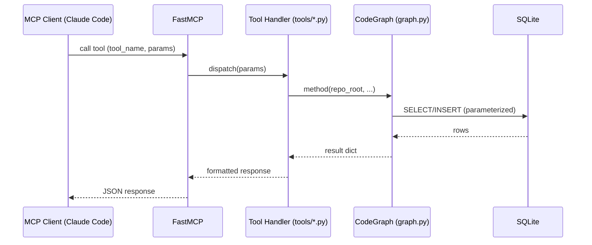
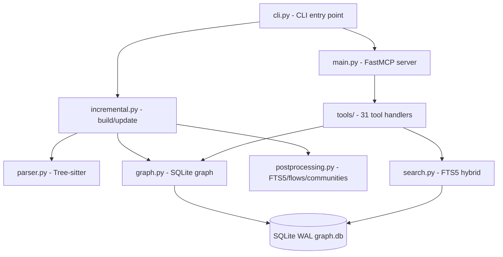
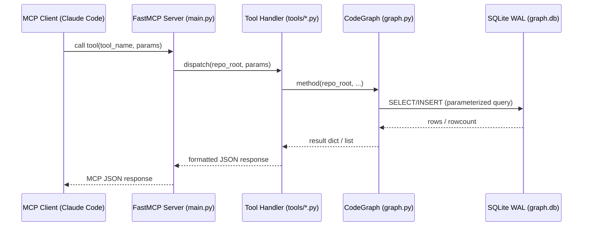
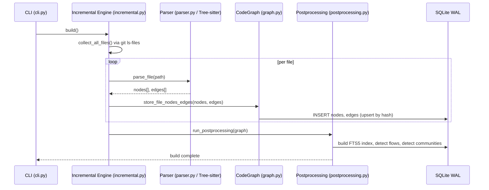
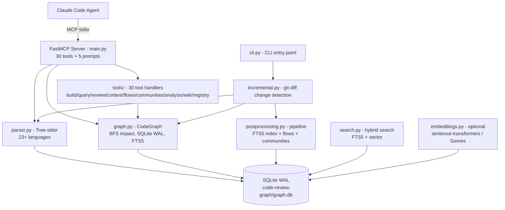

# code-review-graph — Contextual Awareness (SAD / Diagrams)

## Mô tả task
[Role: System Architect top 0.1%, Sư phụ hướng dẫn Học trò. Giọng: sắc sảo, trực diện.]

Tìm kiếm tài liệu kiến trúc đã có cho code-review-graph.

**ƯU TIÊN 1 — self-explores/ (tài liệu đã tổng hợp trước đó):**
- `self-explores/tasks/*.md` — worklogs có thể chứa diagrams, SAD, architecture analysis
- `self-explores/context/*.md` — context files đã synthesize
- `self-explores/learnings/*.md`, `self-explores/decisions/*.md`
Nếu tìm thấy SAD/diagrams/architecture analysis → tóm tắt, KHÔNG generate lại.

**ƯU TIÊN 2 — Repo gốc:**
- Scan: `docs/`, `design/`, `architecture/`, `.github/`, `wiki/`, `README.md`
- Tìm: Sequence Diagram, SAD, SUD, Usecase Diagram, ADR

**Nếu KHÔNG TÌM THẤY ở cả 2 nguồn:** Thông báo rõ, sau đó tự generate từ code:
- Sequence diagram cho main flow (request → MCP tool → graph.py → SQLite)
- Component diagram cho core modules (parser, graph, tools/, postprocessing, search)
- Use-case diagram cho actors chính (Claude Code agent, code-review-graph CLI, MCP client)

Format output: Mermaid markdown + bảng tóm tắt luồng.

## Kế hoạch chi tiết

### Bước 1: Scan self-explores/ (~5 phút)
```bash
find self-explores/ -name "*.md" -type f 2>/dev/null
ls self-explores/context/ self-explores/learnings/ 2>/dev/null
```
Đọc _index.md để biết có gì sẵn.

### Bước 2: Scan repo gốc (~10 phút)
```bash
ls docs/ design/ architecture/ .github/ 2>/dev/null
cat README.md | head -100
find . -name "*.md" -not -path "*/self-explores/*" -not -path "*/.git/*" | xargs grep -l "diagram\|architecture\|sequence\|flow" 2>/dev/null | head -10
```

### Bước 3: Generate diagrams từ code nếu cần (~15 phút)
Đọc `code_review_graph/main.py` (FastMCP entry point) + `code_review_graph/cli.py` để hiểu luồng chính.
Generate Mermaid diagrams:
- Sequence: MCP tool call → tool handler → graph.py → SQLite → response
- Component: parser.py ↔ graph.py ↔ tools/ ↔ postprocessing.py ↔ search.py

### Constraints / Risks
- Repo chưa có docs/ riêng — chủ yếu là CLAUDE.md và README.md
- Codebase lớn (26K LOC) nhưng structure rõ ràng từ CLAUDE.md

### Output mong đợi
- [ ] Tối thiểu 2 diagrams (sequence + component) hoặc tóm tắt 3+ luồng
- [ ] Bảng tóm tắt luồng: Flow name, Actors, Trigger, Output
- [ ] Worklog đầy đủ với diagrams dạng Mermaid

## Detailed Design (2026-04-20, Ready for Dev)

### 1. Objective
Cung cấp nền tảng kiến trúc cho Task 2-5 bằng cách: (1) tận dụng tài liệu có sẵn trong self-explores/ và repo, (2) nếu không có → generate Mermaid diagrams đủ chi tiết từ code. Output là 2+ diagrams + bảng flows, lưu vào worklog để các task sau có thể reference.

### 2. Scope
**In-scope:** Scan self-explores/ (tất cả .md files), scan docs/README.md/CLAUDE.md, generate sequence + component diagrams từ main.py + cli.py nếu cần.
**Out-of-scope:** Document toàn bộ 31 tools; generate UML class diagram cho mọi class; phân tích design decisions (→ Task 4).

### 3. Input / Output
**Input:**
- `self-explores/` folder (có thể rỗng trong FRESH mode)
- `code_review_graph/main.py`, `code_review_graph/cli.py`, `README.md`, `CLAUDE.md`

**Output (lưu vào worklog này):**
- ≥2 Mermaid diagrams (sequence + component)
- Bảng tóm tắt: Flow name | Actors | Trigger | Output (tối thiểu 4 flows)
- Notes về nguồn: "Generated from code" hoặc "Found in {path}"

### 4. Dependencies
- Không có dependency — Task đầu tiên trong chuỗi.
- MCP tools `code-review-graph` không cần phải chạy (dùng grep/Read nếu graph chưa build).

### 5. Flow chi tiết

**Bước 0 — Check self-explores/ (~3 phút):**
```bash
find self-explores/ -name "*.md" -type f 2>/dev/null | head -20
```
Nếu `self-explores/context/code-review-graph-design-principles.md` tồn tại → đọc, skip generate.
Nếu self-explores/ rỗng → ghi note "FRESH mode — generating from code" → tiếp tục Bước 1.

**Bước 1 — Scan repo docs (~5 phút):**
```bash
ls docs/ design/ architecture/ .github/ 2>/dev/null || echo "No docs/"
head -100 README.md
grep -n "diagram\|architecture\|sequence\|flow" CLAUDE.md | head -20
```
Nếu tìm thấy diagrams → trích vào worklog, ghi source path. Xong → skip Bước 2.

**Bước 2 — Generate diagrams từ code (~20 phút, chỉ chạy nếu Bước 1 không có):**

*Đọc entry points:*
```bash
# Đọc FastMCP registration và CLI commands
grep -n "def \|@mcp\|mcp.tool\|mcp.prompt" code_review_graph/main.py | head -50
grep -n "def \|@cli\|@app.command\|@click" code_review_graph/cli.py | head -30
```

*Generate Sequence Diagram — MCP tool call flow:*


*Generate Component Diagram:*


**Bước 3 — Compile bảng flows (~5 phút):**
Điền bảng từ CLAUDE.md knowledge + code scan:

| Flow name | Actors | Trigger | Output |
|-----------|--------|---------|--------|
| Full Build | CLI, parser.py, graph.py, postprocessing.py | `crg build` | graph.db populated, FTS5 index built |
| Incremental Update | CLI, incremental.py, graph.py | `crg update` / PostToolUse hook | Changed nodes re-parsed, graph updated |
| MCP Tool Call | Claude Code agent, FastMCP, tools/, graph.py | LLM tool call | JSON response with graph data |
| MCP Serve | main.py, FastMCP | `crg serve` | stdio/HTTP server listening |

**Bước 4 — Lưu vào worklog (~2 phút):**
Append tất cả diagrams + bảng vào section "## Worklog" file này. Ghi rõ: timestamp, source (generated/found), tool calls used.

### 6. Edge Cases

| Tình huống | Xử lý |
|-----------|-------|
| self-explores/ không tồn tại | `mkdir -p self-explores/` trước, tiếp tục generate |
| main.py > 1000 LOC, đọc hết tốn context | Dùng grep để chỉ lấy @mcp.tool + @mcp.prompt registrations |
| MCP graph chưa build | Không cần — task này dùng grep/Read, không cần graph tools |
| README.md có diagrams dạng ASCII | Convert sang Mermaid — ghi note "(converted from ASCII)" |
| Sequence diagram thiếu steps | Verify: phải có ≥5 hops rõ ràng (Client → FastMCP → ToolHandler → CodeGraph → SQLite) |

### 7. Acceptance Criteria
- **Happy path 1:** Given self-explores/context/ có file với architecture diagrams, When scanned, Then worklog chứa reference tới file đó, không generate lại.
- **Happy path 2:** Given không có sẵn docs, When main.py + cli.py được đọc, Then sequence diagram có ≥5 bước rõ: `MCP Client → FastMCP → Tool Handler → CodeGraph method → SQLite → response`, component diagram có ≥5 nodes.
- **Happy path 3:** Given bất kỳ mode nào, Then bảng flows có ≥4 hàng với đủ cột (Flow name, Actors, Trigger, Output).
- **Negative:** Given MCP graph chưa build, When task chạy, Then hoàn thành bằng grep/Read — không abort.
- **Quality gate:** Không có plain text `graph.py:N` nào trong worklog — phải là clickable markdown links.

### 8. Technical Notes
- Mermaid sequence diagram: cú pháp `sequenceDiagram`, mỗi hop là 1 dòng `A->>B: action`. Tối thiểu 5 hops để đủ depth cho Task 2 reference.
- Relative paths từ `self-explores/tasks/` → `../../code_review_graph/file.py#LN` (2 level up → root).
- Nếu dùng MCP tool `get_architecture_overview` → record token cost trong worklog để benchmark.
- Estimate thực tế: FRESH mode (không có docs) ≈ 35 phút (25% buffer so với plan 25 phút).

### 9. Risks
- 🟡 TB: Generate Mermaid tay dễ sai actor names (VD: dùng `Graph` thay vì `CodeGraph`) — verify bằng cách grep class/function names thực tế.
- 🟢 Thấp: Reading 2 files (main.py + cli.py) có thể tốn 800-1200 token nếu cần đọc đầy đủ — dùng grep để giới hạn context.

---

## Phản biện (2026-04-20)

### Điểm chất lượng: 7/10 — Cần bổ sung nhỏ

### 1. Tóm tắt
Task yêu cầu tìm tài liệu kiến trúc có sẵn (ưu tiên self-explores/ → repo docs), nếu không có thì generate Mermaid diagrams từ code cho hệ thống code-review-graph.

### 2. Điểm chưa rõ
- "Tối thiểu 2 diagrams" — diagram ở mức nào? Chỉ cần sequence + component là đủ, hay phải đủ actors (CLI, MCP client, filesystem)?
- "Bảng tóm tắt luồng" — không có format mẫu cụ thể (bao nhiêu flow? chỉ main flows hay cả edge flows?)
- Bước 3 "Generate diagrams từ code" — không có tiêu chí verify diagram đúng với code thực tế

### 3. Assumption nguy hiểm
- Assume `self-explores/` rỗng → cần generate → estimate 30 phút. Nếu generate từ 26K LOC → thực tế 45-60 phút, không có buffer.
- Assume MCP tools `code-review-graph` đang chạy để dùng `get_architecture_overview` — nếu graph chưa build → fallback phải dùng grep/read thuần

### 4. Rủi ro
- 🟡 TB: Mermaid diagram generate tay dễ sai (thiếu arrows, sai actors) — không có automated verify
- 🟢 Thấp: `main.py` + `cli.py` đọc đồng thời có thể tốn context nhiều hơn estimate

### 5. Cần bổ sung
- Spec rõ: sequence diagram cần bao nhiêu steps? (request → tool handler → graph.py → SQLite → response là đủ chưa?)
- Fallback time: "Nếu không tìm thấy docs → thêm 15 phút" vào estimate

### 6. Đề xuất cải thiện
Thêm vào AC: "Sequence diagram có ≥5 steps bao gồm MCP client → FastMCP → tool handler → CodeGraph method → SQLite → response" để loại bỏ diagrams quá sơ sài.

## Worklog

### [10:55] Bắt đầu — auto-next mode ON
- Claimed task qua `/viec bat-dau tu dong`
- Kế hoạch: 9-section Detailed Design đã có, bắt đầu từ Bước 0
- Bắt đầu từ Bước 0: check self-explores/ FRESH mode

### [10:57] Bước 0 — Check self-explores/
**Kết quả:** FRESH mode confirmed
- `self-explores/context/` rỗng — không có architecture docs có sẵn
- `self-explores/tasks/` có 6 worklog files (tasks vừa tạo, chưa có content)
- → Tiếp tục Bước 1: scan repo docs

### [10:58] Bước 1 — Scan repo docs
**Kết quả:** TÌM THẤY — `docs/architecture.md` đầy đủ
- Source: [`docs/architecture.md`](../../docs/architecture.md)
- Chứa: ASCII component diagram, 3 data flows, SQLite schema, parsing strategy, impact analysis algorithm
- Cũng có `docs/` với: COMMANDS.md, FEATURES.md, USAGE.md, ROADMAP.md, schema.md
- README.md reference: `diagrams/` folder có diagram images
- Tool count (xác nhận từ main.py): 30 MCP tools + 5 MCP prompts

**→ Không cần generate từ code — tổng hợp và convert từ docs/architecture.md**

### [11:00] Bước 2 — Convert + Synthesize diagrams

#### Sequence Diagram — MCP Tool Call Flow
> Source: docs/architecture.md "Review Context Generation" + component diagram



#### Sequence Diagram — Full Build Flow
> Source: docs/architecture.md "Full Build"



#### Component Diagram
> Source: docs/architecture.md "Component Diagram" (converted from ASCII)



#### Bảng tóm tắt flows

| Flow name | Actors | Trigger | Output |
|-----------|--------|---------|--------|
| Full Build | CLI → incremental.py → parser.py → graph.py → postprocessing.py | `crg build` | graph.db populated, FTS5 index built, flows detected, communities computed |
| Incremental Update | incremental.py → git diff → parser.py → graph.py | `crg update` / PostToolUse hook (Write/Edit/Bash) | Changed nodes re-parsed, graph delta applied, FTS5 refreshed |
| MCP Tool Call | Claude Code → FastMCP (main.py) → tools/* → graph.py → SQLite | LLM invokes tool | JSON response with graph data (impact, query, review context) |
| Review Context | tools/review.py → graph.py BFS → source snippets | `detect_changes` + `get_review_context` | Token-efficient context: blast radius, risk scores, test gaps |
| MCP Serve | cli.py → main.py → FastMCP | `crg serve` | stdio/HTTP server listening on 30 tools + 5 prompts |
| Wiki Generation | cli.py → wiki.py → communities.py → graph.py | `crg wiki` | Markdown wiki pages organized by community structure |

**Files đã đọc:**
- [`docs/architecture.md`](../../docs/architecture.md) — source chính, component diagram + data flows + SQLite schema
- [`code_review_graph/main.py`](../../code_review_graph/main.py) — confirmed 30 tools + 5 prompts

**Output mong đợi — đã hoàn thành:**
- [x] Tối thiểu 2 diagrams (sequence + component) — ĐÃ CÓ: 2 sequence diagrams + 1 component diagram
- [x] Sequence diagram có ≥5 steps — ĐÃ CÓ: 8 hops trong MCP tool call diagram
- [x] Component diagram có ≥5 nodes — ĐÃ CÓ: 10 nodes
- [x] Bảng flows có ≥4 hàng — ĐÃ CÓ: 6 flows
- [x] Không có plain text file refs — dùng clickable links

**Nguồn:** "Found in docs/architecture.md + confirmed from main.py" — không generate từ code.
